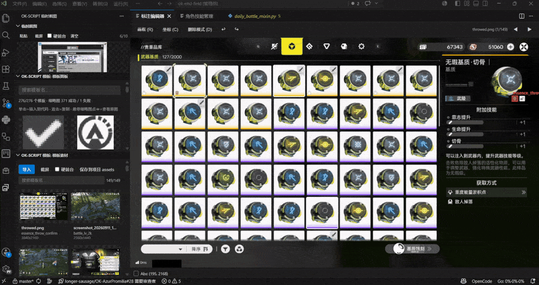
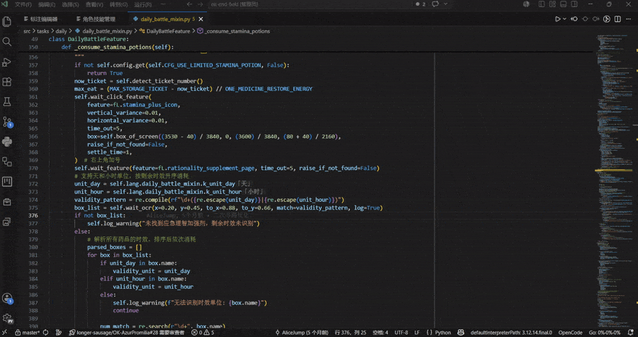
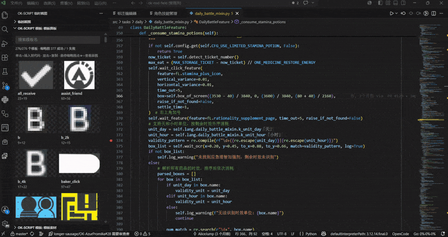
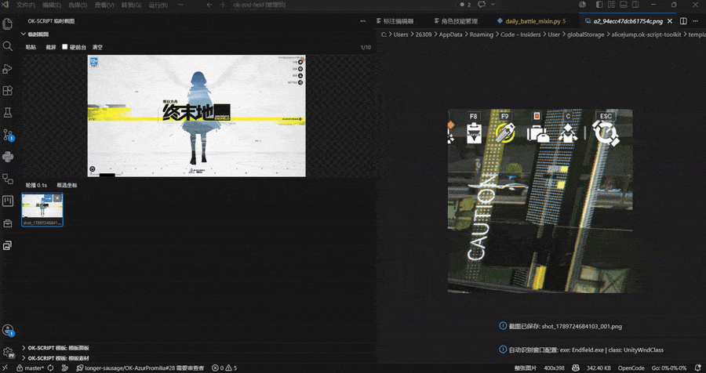
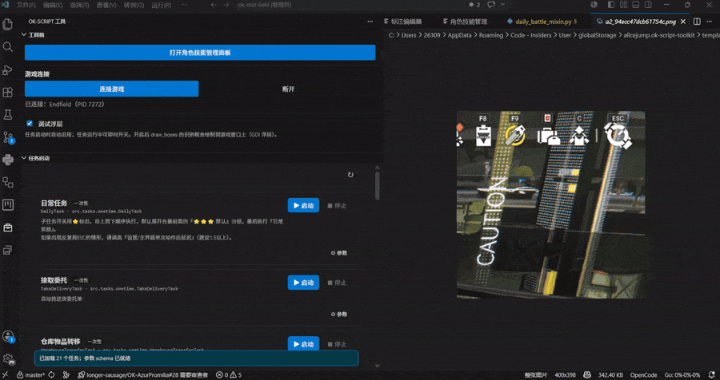

<div align="center">

[](README.md) [](README.en.md)


# ok-script Toolkit

**把 ok-script 的语言、OCR、模板、技能和任务数据，直接搬进 VS Code 的开发流程。**

**Bring ok-script's language keys, OCR fixes, templates, skills and task data straight into your VS Code workflow.**

语言键补全 · OCR 修正提示 · 模板浏览 · 任务启动 · 角色技能管理
Language key completion · OCR fix hints · Template browsing · Task launching · Character skill management

[](https://marketplace.visualstudio.com/items?itemName=AliceJump.ok-script-toolkit)
[](https://plugins.jetbrains.com/plugin/34091-ok-script-toolkit)
[](package.json)
[](LICENSE)
[](package.json)
[Ask DeepWiki](https://deepwiki.com/AliceJump/ok-script-toolkit)

[Install](#installation) · [Features](#features) · [Data Sources](#data-sources) · [Configuration](#configuration) · [Commands](#commands) · [FAQ](#update-not-taking-effect)

</div>

---

VS Code 扩展，为 ok-script 项目的 Python 开发提供语言键、OCR 修正、模板和技能效果的数据提示，同时内置模板浏览、任务启动和角色技能管理面板，让 ok-script 的语言、OCR、模板、技能和任务数据直接进入开发流程。

A VS Code extension that brings ok-script language keys, OCR fixes, templates, skill effects, and task data directly into your Python development workflow. It also includes built-in template browsing, task launching, and character skill management panels.

> [!TIP]
> The demo images at the beginning of each feature section below are clickable — if the GIFs don't load, click the links to view them.

<p align="center">
  <a href="screenshots/hero.gif"></a>
</p>

## Installation

| Method | Steps |
|---|---|
| **In VS Code** | `Ctrl+Shift+X` to open the Extensions view, search for `ok-script Toolkit`, and click **Install** |
| **On the web** | Open the [VS Code Marketplace page](https://marketplace.visualstudio.com/items?itemName=AliceJump.ok-script-toolkit) and click **Install** |
| **CLI** | `code --install-extension AliceJump.ok-script-toolkit` |

Requires VS Code **1.85.0** or later. If the extension doesn't take effect after installation, see [Update not taking effect](#update-not-taking-effect).

For PyCharm / IntelliJ IDEA users, install the JetBrains version: [ok-script Toolkit for JetBrains](https://github.com/AliceJump/ok-script-toolkit-jetbrains) ([Marketplace page](https://plugins.jetbrains.com/plugin/34091-ok-script-toolkit)).

## Features

| Module | Description |
|---|---|
| [Code development assistance](#code-development-assistance) | Complete and explain `self.lang`, OCR regex, and skill effect IDs in the editor |
| [Template management](#template-management) | Browse templates in a grid, click to insert `fL.<name>`, with thumbnail preview |
| [Temp screenshots](#temp-screenshots) | 10-slot scratch area in the activity bar — box-select to copy normalized coordinates |
| [Task launcher](#task-launcher) | Auto-generate parameter forms from `config.py` and run tasks, without writing to the target project's config |
| [Character skill management](#character-skill-management) | Visual management and diagnostics for characters / skills / effects / enhancement groups |
| [Multi-language support](#multi-language-support) | UI supports 6 languages; data hints follow the target project |

### Code Development Assistance

When editing Python code, the extension automatically detects ok-script-specific API contexts and provides precise data hints and completions:

<p align="center">
  <a href="screenshots/code-hints.gif"></a>
</p>

- **`self.lang` language keys**
  Type `self.lang.` to complete language modules and keys. Completion details and inline ghost hints show the current language's value (`string` types use `「value」`, `pattern` types use `~value~`). Hover to see values for all languages: `zh_CN`, `zh_TW`, `en_US`, `ja_JP`, `ko_KR`, `es_ES`.

- **OCR fixes**
  At the `match` parameter of functions like `ocr`, `wait_ocr`, `wait_click_ocr`, `find_boxes`, hover to see all language correction mappings for the regex pattern in `ocr.po`. Inline hints display corrected values (e.g., `→ 体力[0-9]+`). Type inside quotes to complete keys from `ocr.po`.

- **Skill effect IDs**
  Hover over `EffectType.XXX` or `"effect_id": "XXX"` to see the effect ID, category, and Chinese description. Inline ghost hints show the Chinese description (e.g., `「敌人被施加寒冷元素」`). Type inside `effect_id: "` to complete all effect IDs, grouped by category. Data is auto-parsed from `src/data/effects.py` — no manual maintenance needed.

### Template Management

<p align="center">
  <a href="screenshots/template-panel.gif"></a>
</p>

- **Template panel**: Open via the sidebar icon or `Ctrl+Alt+T` shortcut (requires focus on a Python editor). Displays all workspace templates in a thumbnail grid with real-time name search and filtering.
- **Quick insert**: Click a card to insert `fL.<template_name>` at the editor cursor, double-click to copy to clipboard, click the thumbnail to open the source image.
- **Template code hints**: Type `fL.` or `FeatureList.` to complete template names with size info. Hover shows thumbnail preview, dimensions, and source info.
- You can also open a larger grid view in the editor area via the command **ok-script Toolkit: Open Template Panel in Editor**.
- Supports both sidebar (template panel and template asset views) and large editor window browsing modes.

```python
self.wait_click_feature(feature=fL.give_gift, time_out=10)
```

Hover over `fL.give_gift` to see the cropped template image; type `fL.` to select from the template name list.

### Temp Screenshots

<p align="center">
  <a href="screenshots/temp-shots.gif"></a>
</p>

**ok-script Temp Shots** is an **independent container** in the activity bar (with its own icon), providing a scratch area of up to 10 screenshots (the oldest is automatically evicted when full) for quick material capture:

| Capability | Description |
|---|---|
| Enqueue | `Ctrl+V` to paste a clipboard image, click "Screenshot" to capture the game window, or drag image files in directly |
| 0.1s carousel | Cycles through all screenshots at 100ms intervals, useful for observing buttons with movement boundaries |
| Box-select copy | In "Box Select Coords" mode, box-select to copy `x,y,tox,toy` normalized coordinates to the clipboard |
| Import to annotation | The **→** button on the top-right of a thumbnail card imports that shot into the annotation manager (copies into `ok_templates` and registers COCO) |

Details:

- The carousel and box-select are independent — the carousel keeps playing during box-select, and the selection box stays in place after release, making it easy to compare and fine-tune repeatedly.
- Normalized coordinates are scaled to 0..1 based on image width/height, with 4 decimal places. Scroll zoom and middle-click/blank-area drag panning are also supported.
- After box-select, the **box remains and can be adjusted** (with 8-directional handles and full drag support, same interaction as the template annotation box): **coordinates are re-copied on creation and after each adjustment**; the box itself is never written to annotation data or saved to disk. Click outside the box (beyond the frame and handles) to clear it.
- Note: Cross-Webview drag-and-drop is not available in VS Code (each webview is an iframe with a different origin, `dataTransfer` is blocked), so the **→** button is the reliable entry point for import.
- The **annotation editor** also supports this mode: click "Coords (C)" in the toolbar or press `C` to enter box-select mode, copying the same `x,y,tox,toy` normalized coordinates without creating an annotation box or modifying COCO. The resulting box also has handles for fine-tuning, with coordinates re-copied after each adjustment; clicking outside the box in non-interactive areas clears it. Override with `copyCoords` in `okScriptToolkit.annotationKeybindings`.

### Task Launcher

<p align="center">
  <a href="screenshots/task-launcher.gif"></a>
</p>

- Automatically parses all one-time tasks and trigger tasks from the target project's `src/config.py` / `config.py`, generating complete parameter configuration forms.
- Supports multiple parameter types: boolean, number, text, multiline text, dropdown, multi-select, list, cascading dropdown, and structured condition sequences.
- Task names, descriptions, parameter names, and option labels are automatically read from the target project's i18n translations; supports recursively collapsible sub-task configuration trees.
- **Single persistent executor**: Only one process per project — after connecting to the game once, the ok-script framework's native `TaskExecutor` polls all enabled trigger tasks in rotation, enabling multi-trigger task chained polling (the old per-task launch would narrow the trigger task list to a single task).
- **Explicit executor start**: Checking a trigger task only records "which tasks I want to run" — it does **not** auto-launch the executor. Click "Start Executor" in the toolbar to begin; toggling while running still takes effect immediately. When the executor is not running, checked tasks show "Enabled" rather than "Enqueued", so you don't mistake them for actively polling.
- **Trigger task toggle**: The "Enable" checkbox on each card enqueues/dequeues the task. Check state is persisted per project — reopening the panel or restarting the IDE restores it, and the set is applied when you next start the executor.
- **One-time task enqueue**: Click "Launch" to send the task into the same executor's queue; it auto-dequeues after one execution, without spawning a separate process competing for the game window.
- Each project and task has independent parameter overrides. Changes are auto-saved and instantly pushed to the running executor; overrides only affect the executor process's memory and are never written back to the target project's config file.
- **No target-project config pollution**: While the executor runs, all ok-framework reads/writes to `configs/` and screenshots are redirected into the workspace sandbox `.vscode/ok-script-toolkit/`, so **the target project's config files and screenshots stay untouched** (`devices.json` is bridged by copy so the game connection is reused). Tweak parameters freely while debugging without dirtying the project.
- The executor can be paused/resumed at any time (globally suspending polling and tasks), and you can "stop the current task" without closing the executor. Run logs are output to a dedicated output channel.
- **Global config takeover**: the target project's global config groups (visible groups of the ok framework's GlobalConfig) are parsed by the probe as well and shown as parameter snapshots in the console's "Config" segment — edits save instantly and can be reset to defaults; changes are pushed live to the running executor via `gparams`, and the full snapshot is injected as `OK_TOOLKIT_GCONFIG` at executor launch. Still sandbox-only — the target project's config is never touched.
- **Console view**: the task launcher and toolbox live together in the "ok-script console" with four segments (Tasks / Game / Config / Accounts); a health bar in the header reflects executor state in real time, and when idle the detail panel shows the run center (current task / execution queue / trigger polling). Task rows reveal a read-only summary on hover.

### Character Skill Management

Run the command **ok-script Toolkit: Open Character Skill Management Panel** to open the character database overview in the editor area:

- **Filter & View**: Filter characters by star rating, element, profession, skill type, enhancement group, and diagnostic status. View basic info, multi-language names, skill descriptions, multipliers, stagger, cooldown, and SP data.
- **Skill & Enhancement Group Management**: Add, modify, and delete custom skills; configure enhancement groups for any skill with base effects, trigger conditions, and output effects, all selected by category from the effect definitions.
- **Effect Index**: Summarize effects by category and reverse-reference which characters, skills, and enhancement groups use each effect; supports adding new effect categories and definitions.
- **Name Localization Matrix**: Compare character names across all locales side-by-side, highlighting missing translations.
- **Data Diagnostics**: Check for character master table and skill file coverage, duplicate skill IDs, unknown effect IDs, inconsistent enhancement declarations, and missing languages. Diagnostic results can jump to the corresponding file with one click.
- Auto-generates backups before writing, validates via temp files, then atomically replaces source files; the panel auto-refreshes after source file saves.

### Multi-language Support

- The extension UI (notifications, output channel, hover, template panel, task launcher, toolbox, and character skill management panel) supports Simplified Chinese, Traditional Chinese, English, Japanese, Korean, and Spanish, defaulting to the VS Code display language.
- The sidebar is split into three independent activity bar containers: **ok-script Toolbox** (toolbox + task launcher), **ok-script Templates** (template panel + template assets), and **ok-script Temp Shots**.
- Language data in code hints always uses the target project's own locale and original protocol values, unaffected by the plugin UI language.

> [!NOTE]
> Language and template hints only apply to `python` files; effect ID hints (hover, completion, ghost hints) also cover `json` and `jsonc` files. The extension does not modify source code or generate stub files.

## Data Sources

Reads from the current workspace by default:

| Path | Purpose |
|---|---|
| `assets/lang/*.json` | Language data; node format: `{ "string": "..." }` or `{ "pattern": "..." }` |
| `i18n/<locale>/LC_MESSAGES/*.po` | gettext PO data (controlled by `okScriptToolkit.enablePoData`, enabled by default) |
| `assets/coco_annotations.json` | Template names, source images, and `bbox` |
| `assets/images/*.png` | Source images for template previews |
| `ok_tasks/assets/coco_annotations.json` | Optional; read when present |
| `ok_tasks/assets/images/*.png` | Optional; read when present |
| `src/data/effects.py` | Skill effect ID data source (`EffectType` enum + `EFFECT_DESCRIPTIONS` Chinese descriptions) |
| `assets/lang/effect_names.json` | Localized effect names for the character skill management panel; falls back to effect descriptions and raw IDs when missing |

About PO data: Only loads domains within the `okScriptToolkit.poDomains` whitelist (default `ocr`, excluding UI strings like `ok.po`). `msgid` (e.g., `借 款 金 额`, `体力.*`) serves as the key, `msgstr` as the corresponding language's `string` value. `msgid` values containing spaces automatically generate space-stripped copies (e.g., `借款金额`). This data is used for OCR function `match` parameter hints, not as a `self.lang` module.

After saving JSON (including effect names), COCO annotations, PNG, or `effects.py`, the extension auto-refreshes — no project restart needed.

## Build, Install & Release

See [DEVELOPMENT.en.md](DEVELOPMENT.en.md) for project structure, JetBrains version, local installation, and CI/CD release workflow.

## Configuration

| Setting | Default | Description |
|---|---|---|
| `okScriptToolkit.langDirectory` | `assets/lang` | lang JSON directory (relative to workspace root) |
| `okScriptToolkit.poDirectory` | `i18n` | gettext PO directory (relative to workspace root), scanned by `<locale>/LC_MESSAGES/*.po` |
| `okScriptToolkit.enablePoData` | `true` | Enable gettext PO data source, merged with lang JSON |
| `okScriptToolkit.poDomains` | `["ocr"]` | PO domain whitelist to load (default: only `ocr`, excluding UI strings like `ok.po`) |
| `okScriptToolkit.displayLocale` | `auto` | Language for ghost hints; `auto` follows VS Code UI language |
| `okScriptToolkit.enableInlayHints` | `true` | Enable ghost hints |
| `okScriptToolkit.featureAliases` | `["fL", "FeatureList"]` | Template alias list; aliases are used for template completion and hover detection |
| `okScriptToolkit.labelEnumPath` | empty | Path of the generated `LabelEnum.py` (relative to workspace root, with or without `.py`); empty follows the project convention. Maps to `labelEnum.path` |
| `okScriptToolkit.labelEnumName` | empty | Class name of the generated enum; empty derives it from the file name. Maps to `labelEnum.name`. ⚠️ Project code imports this class by name, so renaming it breaks those imports — you will be asked to confirm before an existing file is overwritten |
| `okScriptToolkit.effectsFile` | `src/data/effects.py` | Skill effect ID definition file (`EffectType` enum + `EFFECT_DESCRIPTIONS`), relative to workspace root |
| `okScriptToolkit.okScriptProjectPath` | empty | ok-script project root for the task launcher; tries the current workspace when empty |
| `okScriptToolkit.okScriptPython` | empty | Python for the task launcher; prefers `<project>/.venv/Scripts/python.exe` when empty |
| `okScriptToolkit.captureMethod` | `auto` | Game window capture method: `auto` / `wgc` / `bitblt` / `foreground` |
| `okScriptToolkit.characterProjectPath` | empty | Data project for the character skill management panel; uses `okScriptProjectPath` or current workspace when empty |
| `okScriptToolkit.characterMasterFile` | `assets/data/characters.json` | Character master table JSON |
| `okScriptToolkit.characterSkillsDirectory` | `assets/data/character_skills` | Character skills JSON directory |
| `okScriptToolkit.characterLocaleFile` | `assets/lang/characters.json` | Character name multi-language JSON |
| `okScriptToolkit.characterAvatarTemplateRegex` | `^battle[_-]?icon[_-]?` | Character avatar template name regex; uses the first capture group if present, otherwise the name after the matched prefix, matched against the character master table's English slug; defaults to `battleicon`, `battle_icon`, and `battle-icon` prefixes |
| `okScriptToolkit.okTemplatesDirectory` | `ok_templates` | ok_templates folder name (relative to workspace root), used by the template asset manager |
| `okScriptToolkit.annotationKeybindings` | see defaults | Annotation editor keyboard shortcuts; values are key names with modifier prefixes like `ctrl+z` |

### Project Convention File `ok-script-toolkit.json`

Put **project-scoped** conventions in the **root of the debugged project**: the label
enum's path and class name, the templates directory, executor startup hooks, i18n
(language / PO directories and the gettext toggle), character data locations, the
effects definition file, and so on.
Commit it to the repository and teammates — plus the other IDE (the JetBrains plugin
reads the same file) — get it for free, with no per-machine reconfiguration.

Precedence (high → low):
**personal preference (IDE settings) > project convention file > facts already declared in the project's `config.py` > built-in defaults**.

- When the file is absent, behaviour is **identical to not having it at all** (purely additive)
- The plugins **only read** this file and **never write** to it
- Hover docs and completion are provided in the editor via [`schemas/ok-script-toolkit.schema.json`](schemas/ok-script-toolkit.schema.json)

Settings that take part in the precedence chain ↔ the field they map to:

| IDE setting | Project file field |
|---|---|
| `okTemplatesDirectory` | `templates.directory` |
| `featureAliases` | `labelEnum.aliases` |
| `labelEnumPath` / `labelEnumName` | `labelEnum.path` / `labelEnum.name` (**deliberately the same names**: both mean the same thing, and different names would just be one more word to remember) |
| `langDirectory` / `poDirectory` / `poDomains` | `i18n.langDirectory` / `i18n.poDirectory` / `i18n.poDomains` |
| `enablePoData` | `i18n.enabled` (**deliberately different names**: the setting is "does this machine read it", the field is "what this project's i18n looks like") |
| `characterProjectPath` / `characterMasterFile` / `characterSkillsDirectory` / `characterLocaleFile` / `characterAvatarTemplateRegex` | `characters.projectPath` / `characters.masterFile` / `characters.skillsDirectory` / `characters.localeFile` / `characters.avatarTemplateRegex` |
| `effectsFile` | `effects.file` |

> ⚠️ **Personal preference wins** has a side effect: once you change something yourself,
> the project's declaration for that item is **permanently shadowed** for you, silently.
> The **`okScriptToolkit.showConventionSources`** command ("Project Convention vs My Settings")
> lists which layer each effective value comes from and lets you revert to the project convention.

See [`docs/project-config.md`](docs/project-config.md) for the full field list and design notes,
and [`docs/ok-script-toolkit.example.json`](docs/ok-script-toolkit.example.json) for a copy-paste example.
For **what the plugin actually reads at runtime, what each setting does, and the precedence rules**,
see [`docs/config-reads.md`](docs/config-reads.md) (six read-path types, per-item purpose, the invariants, and a troubleshooting list).

### Configuration Example

In the workspace's `.vscode/settings.json`:

```json
{
	"okScriptToolkit.langDirectory": "assets/lang",
	"okScriptToolkit.poDirectory": "i18n",
	"okScriptToolkit.poDomains": ["ocr"],
	"okScriptToolkit.displayLocale": "zh_CN",
	"okScriptToolkit.enableInlayHints": true,
	"okScriptToolkit.featureAliases": ["fL", "FeatureList"]
}
```

`displayLocale` supports `auto`, `zh_CN`, `zh_TW`, `en_US`, `ja_JP`, `ko_KR`, and `es_ES`. Hover still shows the full language table; this setting only affects inline hints and language completion details.

If your project uses a different variable name, such as `featureList`, you can configure:

```json
{
	"okScriptToolkit.featureAliases": ["fL", "FeatureList", "featureList"]
}
```

**Example effect** — in code:

```python
self.wait_click_ocr(match=self.lang.zip_line_mixin.k_2f4f4a2f, ...)
```

The ghost hint will display `「向目标移动」` after `k_2f4f4a2f`; hover will show a table with values for zh_CN / zh_TW / en_US / ja_JP / ko_KR / es_ES.

## Commands

Command categories display as "ok-script 工具箱" / "ok-script Toolkit" depending on the UI language.

| Command | Shortcut | Description |
|---|---|---|
| `ok-script 工具箱: Open Template Gallery` | `Ctrl+Alt+T` (macOS `Cmd+Alt+T`, requires Python editor focus) | Focus the template sidebar view in the activity bar |
| `ok-script 工具箱: Open Template Gallery in Editor` | — | Open a large grid view in the editor area |
| `ok-script 工具箱: Open Task Launcher` | — | Focus the task launcher view in the activity bar |
| `ok-script 工具箱: Open Character & Skill Manager` | — | Open the character, skill, effect, enhancement group, and name localization management page |
| `ok-script 工具箱: Open Template Assets` | — | Open the template asset management panel in the editor area |
| `ok-script 工具箱: Open Annotation Editor` | — | Prompts to click an image in the template asset panel to enter the COCO annotation editor (the command itself does not open the editor directly) |
| `ok-script 工具箱: Open Temp Screenshots` | — | Focus the temp screenshots view in the activity bar |
| `ok-script 工具箱: Screenshot to Template Assets` | `Ctrl+Alt+S` (macOS `Cmd+Alt+S`) | Open the template asset panel and take a screenshot immediately. Reuses the panel's own screenshot action; the shot is registered into COCO. Rebindable in Keyboard Shortcuts |
| `ok-script 工具箱: Project Convention vs My Settings` | — | List the settings that take part in the precedence chain and show **which layer each effective value comes from** (my settings / project convention / built-in default). Rows you have overridden carry a Revert button that drops your override and goes back to the project convention. Exists to fix "once I changed it, I can never see what the team changed" |

## Update Not Taking Effect

After installing or directly overwriting extension files, run:

`Ctrl+Shift+P` → **Developer: Reload Window**

If you just modified the extension's `package.json` configuration declarations, you must reload the window for the settings to appear in the Settings UI.

---

<div align="center">

**Related**

[ok-script Toolkit for JetBrains](https://github.com/AliceJump/ok-script-toolkit-jetbrains) · [Development Guide](DEVELOPMENT.en.md) · [Release Process](RELEASING.md)

</div>
