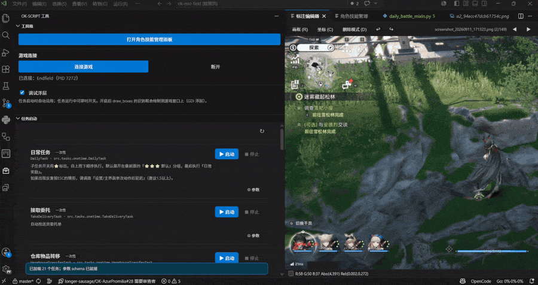

<div align="center">


# ok-script Toolkit

**把 ok-script 的语言、OCR、模板、技能和任务数据，直接搬进 VS Code 的开发流程。**

语言键补全 · OCR 修正提示 · 模板浏览 · 任务启动 · 角色技能管理

[](https://marketplace.visualstudio.com/items?itemName=AliceJump.ok-script-toolkit)
[](https://plugins.jetbrains.com/plugin/34091-ok-script-toolkit)
[](package.json)
[](LICENSE)
[](package.json)

[安装](#安装) · [功能](#功能) · [数据来源](#数据来源) · [配置](#配置) · [命令](#命令) · [常见问题](#更新后不生效)

</div>

---

**中文**

VS Code 扩展，为 ok-script 项目的 Python 开发提供语言键、OCR 修正、模板和技能效果的数据提示，同时内置模板浏览、任务启动和角色技能管理面板，让 ok-script 的语言、OCR、模板、技能和任务数据直接进入开发流程。

> [!TIP]
> 下面每个功能章节开头的演示图都是可点的——如果动图没加载出来，直接点开链接看。

**English**

A VS Code extension that brings ok-script language keys, OCR fixes, templates, skill effects, and task data directly into your Python development workflow. It also includes built-in template browsing, task launching, and character skill management panels.

> [!TIP]
> The demo images at the beginning of each feature section below are clickable — if the GIFs don't load, click the links to view them.

<p align="center">
  <a href="screenshots/hero.gif"></a>
</p>

## 安装 / Installation

### 中文

| 方式 | 操作 |
|---|---|
| **VS Code 内** | `Ctrl+Shift+X` 打开扩展视图，搜索 `ok-script Toolkit`，点 **Install** |
| **网页** | 打开 [VS Code Marketplace 页面](https://marketplace.visualstudio.com/items?itemName=AliceJump.ok-script-toolkit)，点 **Install** |
| **命令行** | `code --install-extension AliceJump.ok-script-toolkit` |

需要 VS Code **1.85.0** 或更高版本。安装后若提示不生效，见 [更新后不生效](#更新后不生效)。

PyCharm / IntelliJ IDEA 用户请装 JetBrains 版：[ok-script Toolkit for JetBrains](jetbrains/README.md)（[Marketplace 页面](https://plugins.jetbrains.com/plugin/34091-ok-script-toolkit)）。

### English

| Method | Steps |
|---|---|
| **In VS Code** | `Ctrl+Shift+X` to open the Extensions view, search for `ok-script Toolkit`, and click **Install** |
| **On the web** | Open the [VS Code Marketplace page](https://marketplace.visualstudio.com/items?itemName=AliceJump.ok-script-toolkit) and click **Install** |
| **CLI** | `code --install-extension AliceJump.ok-script-toolkit` |

Requires VS Code **1.85.0** or later. If the extension doesn't take effect after installation, see [Update not taking effect](#更新后不生效).

For PyCharm / IntelliJ IDEA users, install the JetBrains version: [ok-script Toolkit for JetBrains](jetbrains/README.md) ([Marketplace page](https://plugins.jetbrains.com/plugin/34091-ok-script-toolkit)).

## 功能 / Features

### 中文

| 模块 | 一句话说明 |
|---|---|
| [代码开发辅助](#代码开发辅助) | 在编辑器内补全和解释 `self.lang`、OCR 正则与技能效果 ID |
| [模板管理](#模板管理) | 网格浏览模板，单击插入 `fL.<名称>`，支持缩略图预览 |
| [临时截图](#临时截图) | 活动栏里的 10 张暂存区，框选即可复制归一化坐标 |
| [任务启动](#任务启动) | 从 `config.py` 自动生成参数表单并运行任务，全程不写目标项目配置 |
| [角色技能管理](#角色技能管理) | 角色 / 技能 / 效果 / 强化组的可视化管理与诊断 |
| [多语言支持](#多语言支持) | 界面支持 6 种语言，数据提示跟随目标项目 |

### English

| Module | Description |
|---|---|
| [Code development assistance](#代码开发辅助) | Complete and explain `self.lang`, OCR regex, and skill effect IDs in the editor |
| [Template management](#模板管理) | Browse templates in a grid, click to insert `fL.<name>`, with thumbnail preview |
| [Temp screenshots](#临时截图) | 10-slot scratch area in the activity bar — box-select to copy normalized coordinates |
| [Task launcher](#任务启动) | Auto-generate parameter forms from `config.py` and run tasks, without writing to the target project's config |
| [Character skill management](#角色技能管理) | Visual management and diagnostics for characters / skills / effects / enhancement groups |
| [Multi-language support](#多语言支持) | UI supports 6 languages; data hints follow the target project |

### 代码开发辅助 / Code Development Assistance

#### 中文

在编辑 Python 代码时，扩展自动识别 ok-script 特有的 API 上下文，提供精准的数据提示和补全：

<p align="center">
  <a href="screenshots/code-hints.gif"></a>
</p>

- **`self.lang` 语言键**
  输入 `self.lang.` 补全语言模块和语言键，补全详情和行内幽灵注释显示当前语言的值（`string` 类型用 `「值」`、`pattern` 类型用 `~值~` 标记），悬停可查看 `zh_CN`、`zh_TW`、`en_US`、`ja_JP`、`ko_KR`、`es_ES` 全部语言的值。

- **OCR 修正**
  在 `ocr`、`wait_ocr`、`wait_click_ocr`、`find_boxes` 等函数的 `match` 参数处，悬停可查看正则 pattern 在 `ocr.po` 中的全部语言修正映射，行内显示修正后的值（如 `→ 体力[0-9]+`），引号内输入可补全 `ocr.po` 中的 key。

- **技能效果 ID**
  悬停 `EffectType.XXX` 或 `"effect_id": "XXX"` 显示效果 ID、分类和中文描述，行内幽灵注释显示中文说明（如 `「敌人被施加寒冷元素」`），在 `effect_id: "` 的引号内输入可补全全部效果 ID，按分类展示。数据从 `src/data/effects.py` 自动解析，无需手动维护。

#### English

When editing Python code, the extension automatically detects ok-script-specific API contexts and provides precise data hints and completions:

<p align="center">
  <a href="screenshots/code-hints.gif"></a>
</p>

- **`self.lang` language keys**
  Type `self.lang.` to complete language modules and keys. Completion details and inline ghost hints show the current language's value (`string` types use `「value」`, `pattern` types use `~value~`). Hover to see values for all languages: `zh_CN`, `zh_TW`, `en_US`, `ja_JP`, `ko_KR`, `es_ES`.

- **OCR fixes**
  At the `match` parameter of functions like `ocr`, `wait_ocr`, `wait_click_ocr`, `find_boxes`, hover to see all language correction mappings for the regex pattern in `ocr.po`. Inline hints display corrected values (e.g., `→ 体力[0-9]+`). Type inside quotes to complete keys from `ocr.po`.

- **Skill effect IDs**
  Hover over `EffectType.XXX` or `"effect_id": "XXX"` to see the effect ID, category, and Chinese description. Inline ghost hints show the Chinese description (e.g., `「敌人被施加寒冷元素」`). Type inside `effect_id: "` to complete all effect IDs, grouped by category. Data is auto-parsed from `src/data/effects.py` — no manual maintenance needed.

### 模板管理 / Template Management

#### 中文

<p align="center">
  <a href="screenshots/template-panel.gif"></a>
</p>

- **模板面板**：通过侧边栏图标或 `Ctrl+Alt+T` 快捷键（需聚焦 Python 编辑器时生效）打开，网格展示工作区全部模板的缩略图，支持按名称实时搜索和过滤。
- **快速插入**：单击卡片将 `fL.<模板名>` 插入编辑器光标处，双击复制到剪贴板，点击缩略图打开来源原图。
- **模板代码提示**：输入 `fL.` 或 `FeatureList.` 补全模板名称并显示尺寸，悬停显示缩略图预览、尺寸和来源信息。
- 也可通过命令 **ok-script 工具箱: 在编辑器中打开模板面板** 在编辑器区打开更大的网格视图。
- 支持侧边栏（模板面板和模板素材两个视图）和编辑器大窗口两种浏览方式。

```python
self.wait_click_feature(feature=fL.give_gift, time_out=10)
```

悬停 `fL.give_gift` 可查看对应模板裁剪图；输入 `fL.` 可从模板名称列表中选择。

#### English

<p align="center">
  <a href="screenshots/template-panel.gif"></a>
</p>

- **Template panel**: Open via the sidebar icon or `Ctrl+Alt+T` shortcut (requires focus on a Python editor). Displays all workspace templates in a thumbnail grid with real-time name search and filtering.
- **Quick insert**: Click a card to insert `fL.<template_name>` at the editor cursor, double-click to copy to clipboard, click the thumbnail to open the source image.
- **Template code hints**: Type `fL.` or `FeatureList.` to complete template names with size info. Hover shows thumbnail preview, dimensions, and source info.
- You can also open a larger grid view in the editor area via the command **ok-script Toolkit: Open Template Panel in Editor**.
- Supports both sidebar (template panel and template asset views) and large editor window browsing modes.

```python
self.wait_click_feature(feature=fL.give_gift, time_out=10)
```

Hover over `fL.give_gift` to see the cropped template image; type `fL.` to select from the template name list.

### 临时截图 / Temp Screenshots

#### 中文

<p align="center">
  <a href="screenshots/temp-shots.gif"></a>
</p>

**ok-script 临时截图** 是活动栏上的**独立容器**（有自己的图标），里面是一个最多 10 张的暂存区（超出自动淘汰最早一张），用于快速取素材：

| 能力 | 说明 |
|---|---|
| 入列 | `Ctrl+V` 粘贴剪贴板图片、点「截屏」截取游戏窗口，或直接把图片文件拖进来 |
| 0.1s 轮播 | 按 100ms 间隔循环播放全部截图，方便观察有移动界限的按钮等目标 |
| 框选复制 | 在「框选坐标」模式下框选，把 `x,y,tox,toy` 归一化坐标复制到剪贴板 |
| 导入标注 | 缩略图卡片右上角的 **→** 按钮把该张导入「标注管理」（即复制进 `ok_templates` 并登记 COCO） |

细节说明：

- 轮播与框选相互独立——框选期间轮播不停，选框松手后保留在原位，便于反复比对微调。
- 归一化坐标按图片宽高归一化到 0..1，保留 4 位小数，同样支持滚轮缩放、中键/空白拖拽平移。
- 框选完成后**框会保留并可继续调整**（带 8 向手柄、可整体拖动，交互与模板标注框一致）：**创建时与每次调整结束都会重新复制一次当前框的坐标**；框本身不写入标注数据、不落盘。点击图片的非交互部分（框体与手柄之外）即清除。
- 注：VS Code 的跨 Webview 拖拽不可用（各 webview 是不同 origin 的 iframe，`dataTransfer` 被屏蔽），所以 **→** 按钮是导入的可靠入口。
- **标注编辑器**同样支持该模式：工具栏「坐标 (C)」或按 `C` 键后框选，直接复制同样的 `x,y,tox,toy` 归一化坐标，不会创建标注框、不改动 COCO。得到的框同样带手柄可继续微调，每次调整结束重新复制；点击图片非交互部分清除。快捷键可用 `okScriptToolkit.annotationKeybindings` 的 `copyCoords` 覆盖。

#### English

<p align="center">
  <a href="screenshots/temp-shots.gif"></a>
</p>

**ok-script Temp Shots** is an **independent container** in the activity bar (with its own icon), providing a scratch area of up to 10 screenshots (the oldest is automatically evicted when full) for quick material capture:

| Capability | Description |
|---|---|
| Enqueue | `Ctrl+V` to paste a clipboard image, click "Screenshot" to capture the game window, or drag image files in directly |
| 0.1s carousel | Cycles through all screenshots at 100ms intervals, useful for observing buttons with movement boundaries |
| Box-select copy | In "Box Select Coords" mode, box-select to copy `x,y,tox,toy` normalized coordinates to the clipboard |
| Import to annotation | The **→** button on the top-right of a thumbnail card imports that shot into the annotation manager (copies into `ok_templates` and registers COCO) |

Details:

- The carousel and box-select are independent — the carousel keeps playing during box-select, and the selection box stays in place after release, making it easy to compare and fine-tune repeatedly.
- Normalized coordinates are scaled to 0..1 based on image width/height, with 4 decimal places. Scroll zoom and middle-click/blank-area drag panning are also supported.
- After box-select, the **box remains and can be adjusted** (with 8-directional handles and full drag support, same interaction as the template annotation box): **coordinates are re-copied on creation and after each adjustment**; the box itself is never written to annotation data or saved to disk. Click outside the box (beyond the frame and handles) to clear it.
- Note: Cross-Webview drag-and-drop is not available in VS Code (each webview is an iframe with a different origin, `dataTransfer` is blocked), so the **→** button is the reliable entry point for import.
- The **annotation editor** also supports this mode: click "Coords (C)" in the toolbar or press `C` to enter box-select mode, copying the same `x,y,tox,toy` normalized coordinates without creating an annotation box or modifying COCO. The resulting box also has handles for fine-tuning, with coordinates re-copied after each adjustment; clicking outside the box in non-interactive areas clears it. Override with `copyCoords` in `okScriptToolkit.annotationKeybindings`.

### 任务启动 / Task Launcher

#### 中文

<p align="center">
  <a href="screenshots/task-launcher.gif"></a>
</p>

- 从目标项目的 `src/config.py` / `config.py` 自动解析所有一次性任务和触发任务，生成完整的参数配置表单。
- 支持布尔、数字、文本、多行文本、下拉、多选、列表、项目级联下拉和结构化条件序列等多种参数类型。
- 任务名、说明、参数名和选项标签自动读取目标项目 i18n 翻译显示；支持递归可折叠的子任务配置树。
- **单一常驻执行器**：整个项目只维持一个进程——连接一次游戏后，由 ok-script 框架原生的 `TaskExecutor` 循环轮询全部已启用的触发任务，实现多触发任务串连轮询（旧版逐个启动会让框架把触发任务列表收窄成单个）。
- **执行器显式启动**：勾选触发任务只是「记录我要跑哪些」，**不会**自动拉起执行器；点工具栏的「启动执行器」按钮才开始运行，运行中勾选依然即时生效。执行器未运行时，已勾选的任务显示「已启用」而非「已入列」，避免误以为正在轮询。
- **触发任务勾选启用**：卡片上的「启用」勾选框即入列 / 出列，勾选状态按项目持久化，重开面板或重启 IDE 后仍是勾选状态，下次启动执行器时按此集合入列。
- **一次性任务入队**：点「启动」把任务送进同一个执行器的队列，执行一次后自动出队，不会另起进程争抢游戏窗口。
- 每个项目、每个任务独立保存参数覆盖，参数修改后自动保存并即时推送给运行中的执行器；覆盖只作用于执行器进程的内存，不写回目标项目配置文件。
- **不污染目标项目配置**：执行器运行时，ok 框架对 `configs/` 与截图的读写全部改道到工作区的沙箱目录 `.vscode/ok-script-toolkit/`，**目标项目的配置文件与截图全程保持原样**（`devices.json` 做桥接拷贝以复用游戏连接）。调试时可以放心地改参数试跑，不会弄脏项目。
- 执行器可随时暂停/恢复（全局挂起轮询与任务），也可以「停止当前任务」而不关闭执行器；运行日志输出到专属输出频道。

#### English

<p align="center">
  <a href="screenshots/task-launcher.gif"></a>
</p>

- Automatically parses all one-time tasks and trigger tasks from the target project's `src/config.py` / `config.py`, generating complete parameter configuration forms.
- Supports multiple parameter types: boolean, number, text, multiline text, dropdown, multi-select, list, cascading dropdown, and structured condition sequences.
- Task names, descriptions, parameter names, and option labels are automatically read from the target project's i18n translations; supports recursively collapsible sub-task configuration trees.
- **Single persistent executor**: Only one process per project — after connecting to the game once, the ok-script framework's native `TaskExecutor` polls all enabled trigger tasks in rotation, enabling multi-trigger task chained polling (the old per-task launch would narrow the trigger task list to a single task).
- **Explicit executor start**: Checking a trigger task only records "which tasks I want to run" — it does **not** auto-launch the executor. Click "Start Executor" in the toolbar to begin; toggling while running still takes effect immediately. When the executor is not running, checked tasks show "Enabled" rather than "Enqueued", so you don't mistake them for actively polling.
- **Trigger task toggle**: The "Enable" checkbox on each card enqueues/dequeues the task. Check state is persisted per project — reopening the panel or restarting the IDE restores it, and the set is applied when you next start the executor.
- **One-time task enqueue**: Click "Launch" to send the task into the same executor's queue; it auto-dequeues after one execution, without spawning a separate process competing for the game window.
- Each project and task has independent parameter overrides. Changes are auto-saved and instantly pushed to the running executor; overrides only affect the executor process's memory and are never written back to the target project's config file.
- **No target-project config pollution**: While the executor runs, all ok-framework reads/writes to `configs/` and screenshots are redirected into the workspace sandbox `.vscode/ok-script-toolkit/`, so **the target project's config files and screenshots stay untouched** (`devices.json` is bridged by copy so the game connection is reused). Tweak parameters freely while debugging without dirtying the project.
- The executor can be paused/resumed at any time (globally suspending polling and tasks), and you can "stop the current task" without closing the executor. Run logs are output to a dedicated output channel.

### 角色技能管理 / Character Skill Management

#### 中文

<p align="center">
  <a href="screenshots/character-manager.gif"></a>
</p>

执行命令 **ok-script 工具箱: 打开角色技能管理面板**，在编辑器区打开角色数据库总览：

- **筛选与查看**：按星级、元素、职业、技能类型、强化组和诊断状态筛选角色，查看角色基础信息、多语言名称、技能说明、倍率、失衡、冷却和技力等数据。
- **技能与强化组管理**：添加、修改、删除自定义技能；为任意技能配置强化组的基础效果、触发条件和产出效果，均从效果定义中按类别多选。
- **效果索引**：按效果分类汇总，并反向列出每个效果被哪些角色、技能和强化组引用；支持添加新的效果类别和效果定义。
- **名称本地化矩阵**：横向比较全部 locale 的角色名称，突出显示缺失翻译。
- **数据诊断**：检查角色主表与技能文件覆盖、重复技能 ID、未知效果 ID、强化声明不一致和缺失语言等问题，诊断结果可一键跳转到对应文件。
- 写入前自动生成备份，通过临时文件校验后原子替换源文件；源文件保存后面板自动刷新。

#### English

Run the command **ok-script Toolkit: Open Character Skill Management Panel** to open the character database overview in the editor area:

- **Filter & View**: Filter characters by star rating, element, profession, skill type, enhancement group, and diagnostic status. View basic info, multi-language names, skill descriptions, multipliers, stagger, cooldown, and SP data.
- **Skill & Enhancement Group Management**: Add, modify, and delete custom skills; configure enhancement groups for any skill with base effects, trigger conditions, and output effects, all selected by category from the effect definitions.
- **Effect Index**: Summarize effects by category and reverse-reference which characters, skills, and enhancement groups use each effect; supports adding new effect categories and definitions.
- **Name Localization Matrix**: Compare character names across all locales side-by-side, highlighting missing translations.
- **Data Diagnostics**: Check for character master table and skill file coverage, duplicate skill IDs, unknown effect IDs, inconsistent enhancement declarations, and missing languages. Diagnostic results can jump to the corresponding file with one click.
- Auto-generates backups before writing, validates via temp files, then atomically replaces source files; the panel auto-refreshes after source file saves.

### 多语言支持 / Multi-language Support

#### 中文

- 扩展界面（通知、输出频道、hover、模板面板、任务启动器、工具箱和角色技能管理面板）支持简体中文、繁体中文、英文、日文、韩文和西班牙文，默认跟随 VS Code 显示语言。
- 侧边栏分为 **ok-script 工具**（工具箱 + 任务启动）、**ok-script 模板**（模板面板 + 模板素材）和 **ok-script 临时截图** 三个独立活动栏容器。
- 代码提示中的语言数据始终使用目标项目自身的 locale 和原始协议值，不受插件界面语言影响。

> [!NOTE]
> 语言与模板提示只针对 `python` 文件生效；效果 ID 提示（hover、补全、幽灵注释）额外覆盖 `json` 和 `jsonc` 文件。扩展不修改源代码，也不生成存根文件。

#### English

- The extension UI (notifications, output channel, hover, template panel, task launcher, toolbox, and character skill management panel) supports Simplified Chinese, Traditional Chinese, English, Japanese, Korean, and Spanish, defaulting to the VS Code display language.
- The sidebar is split into three independent activity bar containers: **ok-script Toolbox** (toolbox + task launcher), **ok-script Templates** (template panel + template assets), and **ok-script Temp Shots**.
- Language data in code hints always uses the target project's own locale and original protocol values, unaffected by the plugin UI language.

> [!NOTE]
> Language and template hints only apply to `python` files; effect ID hints (hover, completion, ghost hints) also cover `json` and `jsonc` files. The extension does not modify source code or generate stub files.

## 数据来源 / Data Sources

### 中文

默认从当前工作区读取：

| 路径 | 用途 |
|---|---|
| `assets/lang/*.json` | 语言数据，节点格式为 `{ "string": "..." }` 或 `{ "pattern": "..." }` |
| `i18n/<locale>/LC_MESSAGES/*.po` | gettext PO 数据（`okScriptToolkit.enablePoData` 控制，默认开启） |
| `assets/coco_annotations.json` | 模板名称、原图和 `bbox` |
| `assets/images/*.png` | 模板预览使用的原图 |
| `ok_tasks/assets/coco_annotations.json` | 可选，存在时一并读取 |
| `ok_tasks/assets/images/*.png` | 可选，存在时一并读取 |
| `src/data/effects.py` | 技能效果 ID 数据源（`EffectType` 枚举 + `EFFECT_DESCRIPTIONS` 中文描述） |
| `assets/lang/effect_names.json` | 角色技能管理面板中的效果本地化名称；缺失时回退到效果描述和原始 ID |

关于 PO 数据：仅加载 `okScriptToolkit.poDomains` 白名单内的 domain（默认 `ocr`，排除 `ok.po` 等 UI 通用文案）。`msgid`（如 `借 款 金 额`、`体力.*`）作为 key，`msgstr` 作为对应语言的 `string` 值；含空格的 `msgid` 会自动生成去空格副本（`借款金额`）。该数据用于 OCR 函数 `match` 参数的提示，不作为 `self.lang` 模块。

保存 JSON（包括效果名称）、COCO 标注、PNG 或 `effects.py` 后，扩展会自动刷新，无需重启项目。

### English

Reads from the current workspace by default:

| Path | Purpose |
|---|---|
| `assets/lang/*.json` | Language data; node format: `{ "string": "..." }` or `{ "pattern": "..." }` |
| `i18n/<locale>/LC_MESSAGES/*.po` | gettext PO data (controlled by `okScriptToolkit.enablePoData`, enabled by default) |
| `assets/coco_annotations.json` | Template names, source images, and `bbox` |
| `assets/images/*.png` | Source images for template previews |
| `ok_tasks/assets/coco_annotations.json` | Optional; read when present |
| `ok_tasks/assets/images/*.png` | Optional; read when present |
| `src/data/effects.py` | Skill effect ID data source (`EffectType` enum + `EFFECT_DESCRIPTIONS` Chinese descriptions) |
| `assets/lang/effect_names.json` | Localized effect names for the character skill management panel; falls back to effect descriptions and raw IDs when missing |

About PO data: Only loads domains within the `okScriptToolkit.poDomains` whitelist (default `ocr`, excluding UI strings like `ok.po`). `msgid` (e.g., `借 款 金 额`, `体力.*`) serves as the key, `msgstr` as the corresponding language's `string` value. `msgid` values containing spaces automatically generate space-stripped copies (e.g., `借款金额`). This data is used for OCR function `match` parameter hints, not as a `self.lang` module.

After saving JSON (including effect names), COCO annotations, PNG, or `effects.py`, the extension auto-refreshes — no project restart needed.

## 构建、安装与发布 / Build, Install & Release

### 中文

项目结构、JetBrains 版本、本地安装和 CI/CD 发布流程详见 [DEVELOPMENT.md](DEVELOPMENT.md)。

### English

See [DEVELOPMENT.md](DEVELOPMENT.md) for project structure, JetBrains version, local installation, and CI/CD release workflow.

## 配置 / Configuration

### 中文

| 配置项 | 默认值 | 说明 |
|---|---|---|
| `okScriptToolkit.langDirectory` | `assets/lang` | lang JSON 目录（相对工作区根） |
| `okScriptToolkit.poDirectory` | `i18n` | gettext PO 目录（相对工作区根），按 `<locale>/LC_MESSAGES/*.po` 扫描 |
| `okScriptToolkit.enablePoData` | `true` | 是否启用 gettext PO 数据源，与 lang JSON 合并 |
| `okScriptToolkit.poDomains` | `["ocr"]` | 要加载的 PO domain 白名单（默认只加载 ocr，排除 ok 等 UI 文案） |
| `okScriptToolkit.displayLocale` | `auto` | 幽灵注释显示的语言；`auto` 跟随 VS Code UI 语言 |
| `okScriptToolkit.enableInlayHints` | `true` | 是否启用幽灵注释 |
| `okScriptToolkit.featureAliases` | `["fL", "FeatureList"]` | 模板别名列表；别名会用于模板补全和 hover 识别 |
| `okScriptToolkit.effectsFile` | `src/data/effects.py` | 技能效果 ID 定义文件（`EffectType` 枚举与 `EFFECT_DESCRIPTIONS`），相对工作区根目录 |
| `okScriptToolkit.okScriptProjectPath` | 空 | 任务启动器使用的 ok-script 项目根目录；为空时尝试使用当前工作区 |
| `okScriptToolkit.okScriptPython` | 空 | 任务启动器使用的 Python；为空时优先使用目标项目 `.venv/Scripts/python.exe` |
| `okScriptToolkit.captureMethod` | `auto` | 游戏窗口截图方式：`auto` / `wgc` / `bitblt` / `foreground` |
| `okScriptToolkit.characterProjectPath` | 空 | 角色技能管理面板的数据项目；为空时使用 `okScriptProjectPath` 或当前工作区 |
| `okScriptToolkit.characterMasterFile` | `assets/data/characters.json` | 角色主表 JSON |
| `okScriptToolkit.characterSkillsDirectory` | `assets/data/character_skills` | 角色技能 JSON 目录 |
| `okScriptToolkit.characterLocaleFile` | `assets/lang/characters.json` | 角色名称多语言 JSON |
| `okScriptToolkit.characterAvatarTemplateRegex` | `^battle[_-]?icon[_-]?` | 角色头像模板名正则；有捕获组时使用第一组，否则使用匹配前缀后的剩余名称，与角色主表英文 slug 匹配；默认兼容 `battleicon`、`battle_icon` 和 `battle-icon` 前缀 |
| `okScriptToolkit.okTemplatesDirectory` | `ok_templates` | ok_templates 文件夹名（相对工作区根），供模板素材管理器使用 |
| `okScriptToolkit.annotationKeybindings` | 见默认值 | 标注编辑器的键盘快捷键；值为按键名，支持 `ctrl+z` 等修饰符前缀 |

#### 项目约定文件 `ok-script-toolkit.json`

把**随项目走**的约定写在被调试项目的**根目录**：枚举文件路径与类名、模板目录、
执行器启动钩子等。提交进仓库后，团队成员、以及另一个 IDE（JetBrains 插件读同一份）
都能直接用，不必各自在 IDE 设置里重配一遍。

取值优先级（高 → 低）：
**个人偏好（IDE 设置）> 项目约定文件 > 项目 `config.py` 已声明的事实 > 内置默认**。

- 文件**缺席时行为与不引入它时完全一致**（纯增量）
- 插件**只读**本文件，**绝不写入**
- 编辑器里对它提供悬浮说明与补全（来自 [`schemas/ok-script-toolkit.schema.json`](schemas/ok-script-toolkit.schema.json)）

完整字段清单与设计说明见 [`docs/project-config.md`](docs/project-config.md)，
可直接复制的示例见 [`docs/ok-script-toolkit.example.json`](docs/ok-script-toolkit.example.json)。

#### 配置示例

在工作区的 `.vscode/settings.json` 中：

```json
{
	"okScriptToolkit.langDirectory": "assets/lang",
	"okScriptToolkit.poDirectory": "i18n",
	"okScriptToolkit.poDomains": ["ocr"],
	"okScriptToolkit.displayLocale": "zh_CN",
	"okScriptToolkit.enableInlayHints": true,
	"okScriptToolkit.featureAliases": ["fL", "FeatureList"]
}
```

`displayLocale` 支持 `auto`、`zh_CN`、`zh_TW`、`en_US`、`ja_JP`、`ko_KR` 和 `es_ES`。hover 仍会显示完整语言表格；该设置只影响行内提示和语言补全详情。

如果项目使用了其他变量名，例如 `featureList`，可以配置：

```json
{
	"okScriptToolkit.featureAliases": ["fL", "FeatureList", "featureList"]
}
```

**示例效果**——在代码中：

```python
self.wait_click_ocr(match=self.lang.zip_line_mixin.k_2f4f4a2f, ...)
```

幽灵注释会在 `k_2f4f4a2f` 后面显示 `「向目标移动」`；hover 会弹出包含 zh_CN / zh_TW / en_US / ja_JP / ko_KR / es_ES 全部值的表格。

### English

| Setting | Default | Description |
|---|---|---|
| `okScriptToolkit.langDirectory` | `assets/lang` | lang JSON directory (relative to workspace root) |
| `okScriptToolkit.poDirectory` | `i18n` | gettext PO directory (relative to workspace root), scanned by `<locale>/LC_MESSAGES/*.po` |
| `okScriptToolkit.enablePoData` | `true` | Enable gettext PO data source, merged with lang JSON |
| `okScriptToolkit.poDomains` | `["ocr"]` | PO domain whitelist to load (default: only `ocr`, excluding UI strings like `ok.po`) |
| `okScriptToolkit.displayLocale` | `auto` | Language for ghost hints; `auto` follows VS Code UI language |
| `okScriptToolkit.enableInlayHints` | `true` | Enable ghost hints |
| `okScriptToolkit.featureAliases` | `["fL", "FeatureList"]` | Template alias list; aliases are used for template completion and hover detection |
| `okScriptToolkit.effectsFile` | `src/data/effects.py` | Skill effect ID definition file (`EffectType` enum + `EFFECT_DESCRIPTIONS`), relative to workspace root |
| `okScriptToolkit.okScriptProjectPath` | empty | ok-script project root for the task launcher; tries the current workspace when empty |
| `okScriptToolkit.okScriptPython` | empty | Python for the task launcher; prefers `<project>/.venv/Scripts/python.exe` when empty |
| `okScriptToolkit.captureMethod` | `auto` | Game window capture method: `auto` / `wgc` / `bitblt` / `foreground` |
| `okScriptToolkit.characterProjectPath` | empty | Data project for the character skill management panel; uses `okScriptProjectPath` or current workspace when empty |
| `okScriptToolkit.characterMasterFile` | `assets/data/characters.json` | Character master table JSON |
| `okScriptToolkit.characterSkillsDirectory` | `assets/data/character_skills` | Character skills JSON directory |
| `okScriptToolkit.characterLocaleFile` | `assets/lang/characters.json` | Character name multi-language JSON |
| `okScriptToolkit.characterAvatarTemplateRegex` | `^battle[_-]?icon[_-]?` | Character avatar template name regex; uses the first capture group if present, otherwise the name after the matched prefix, matched against the character master table's English slug; defaults to `battleicon`, `battle_icon`, and `battle-icon` prefixes |
| `okScriptToolkit.okTemplatesDirectory` | `ok_templates` | ok_templates folder name (relative to workspace root), used by the template asset manager |
| `okScriptToolkit.annotationKeybindings` | see defaults | Annotation editor keyboard shortcuts; values are key names with modifier prefixes like `ctrl+z` |

#### Project Convention File `ok-script-toolkit.json`

Put **project-scoped** conventions in the **root of the debugged project**: the label
enum's path and class name, the templates directory, executor startup hooks, and so on.
Commit it to the repository and teammates — plus the other IDE (the JetBrains plugin
reads the same file) — get it for free, with no per-machine reconfiguration.

Precedence (high → low):
**personal preference (IDE settings) > project convention file > facts already declared in the project's `config.py` > built-in defaults**.

- When the file is absent, behaviour is **identical to not having it at all** (purely additive)
- The plugins **only read** this file and **never write** to it
- Hover docs and completion are provided in the editor via [`schemas/ok-script-toolkit.schema.json`](schemas/ok-script-toolkit.schema.json)

See [`docs/project-config.md`](docs/project-config.md) for the full field list and design notes,
and [`docs/ok-script-toolkit.example.json`](docs/ok-script-toolkit.example.json) for a copy-paste example.

#### Configuration Example

In the workspace's `.vscode/settings.json`:

```json
{
	"okScriptToolkit.langDirectory": "assets/lang",
	"okScriptToolkit.poDirectory": "i18n",
	"okScriptToolkit.poDomains": ["ocr"],
	"okScriptToolkit.displayLocale": "zh_CN",
	"okScriptToolkit.enableInlayHints": true,
	"okScriptToolkit.featureAliases": ["fL", "FeatureList"]
}
```

`displayLocale` supports `auto`, `zh_CN`, `zh_TW`, `en_US`, `ja_JP`, `ko_KR`, and `es_ES`. Hover still shows the full language table; this setting only affects inline hints and language completion details.

If your project uses a different variable name, such as `featureList`, you can configure:

```json
{
	"okScriptToolkit.featureAliases": ["fL", "FeatureList", "featureList"]
}
```

**Example effect** — in code:

```python
self.wait_click_ocr(match=self.lang.zip_line_mixin.k_2f4f4a2f, ...)
```

The ghost hint will display `「向目标移动」` after `k_2f4f4a2f`; hover will show a table with values for zh_CN / zh_TW / en_US / ja_JP / ko_KR / es_ES.

## 命令 / Commands

### 中文

命令分类随界面语言显示为「ok-script 工具箱」/「ok-script Toolkit」。

| 命令 | 快捷键 | 说明 |
|---|---|---|
| `ok-script 工具箱: 打开模板面板` | `Ctrl+Alt+T`（macOS `Cmd+Alt+T`，需聚焦 Python 编辑器） | 聚焦活动栏中的模板侧边栏视图 |
| `ok-script 工具箱: 在编辑器中打开模板面板` | — | 在编辑器区打开大窗口网格视图 |
| `ok-script 工具箱: 打开任务启动` | — | 聚焦活动栏中的任务启动器视图 |
| `ok-script 工具箱: 打开角色技能管理面板` | — | 打开角色、技能、效果、强化组和名称本地化管理页 |
| `ok-script 工具箱: 打开模板素材` | — | 在编辑器区打开模板素材管理大窗口面板 |
| `ok-script 工具箱: 打开标注编辑器` | — | 提示在模板素材面板中点击图片以进入 COCO 标注编辑器（命令本身不直接打开编辑器） |
| `ok-script 工具箱: 打开临时截图` | — | 聚焦活动栏中的临时截图视图 |
| `ok-script 工具箱: 截图并打开模板素材` | `Ctrl+Alt+S`（macOS `Cmd+Alt+S`） | 打开模板素材管理面板并立即截图。复用面板自己的截图动作，截图会登记进 COCO。键位可在「键盘快捷方式」里改 |
| `ok-script 工具箱: 项目约定 vs 我的设置` | — | 列出参与取值链的设置项，显示每一项的**生效值来自哪一层**（我的设置 / 项目约定 / 内置默认）。被个人设置覆盖过的项带一个「恢复」按钮，一键回到项目约定。用于解决"我改过一次就再也看不到团队改了什么" |

### English

Command categories display as "ok-script 工具箱" / "ok-script Toolkit" depending on the UI language.

| Command | Shortcut | Description |
|---|---|---|
| `ok-script 工具箱: Open Template Gallery` | `Ctrl+Alt+T` (macOS `Cmd+Alt+T`, requires Python editor focus) | Focus the template sidebar view in the activity bar |
| `ok-script 工具箱: Open Template Gallery in Editor` | — | Open a large grid view in the editor area |
| `ok-script 工具箱: Open Task Launcher` | — | Focus the task launcher view in the activity bar |
| `ok-script 工具箱: Open Character & Skill Manager` | — | Open the character, skill, effect, enhancement group, and name localization management page |
| `ok-script 工具箱: Open Template Assets` | — | Open the template asset management panel in the editor area |
| `ok-script 工具箱: Open Annotation Editor` | — | Prompts to click an image in the template asset panel to enter the COCO annotation editor (the command itself does not open the editor directly) |
| `ok-script 工具箱: Open Temp Screenshots` | — | Focus the temp screenshots view in the activity bar |
| `ok-script 工具箱: Screenshot to Template Assets` | `Ctrl+Alt+S` (macOS `Cmd+Alt+S`) | Open the template asset panel and take a screenshot immediately. Reuses the panel's own screenshot action; the shot is registered into COCO. Rebindable in Keyboard Shortcuts |
| `ok-script 工具箱: Project Convention vs My Settings` | — | List the settings that take part in the precedence chain and show **which layer each effective value comes from** (my settings / project convention / built-in default). Rows you have overridden carry a Revert button that drops your override and goes back to the project convention. Exists to fix "once I changed it, I can never see what the team changed" |

## 更新后不生效 / Update Not Taking Effect

### 中文

安装或直接覆盖扩展文件后执行：

`Ctrl+Shift+P` → **Developer: Reload Window**

如果刚修改了扩展的 `package.json` 配置声明，必须 reload 窗口后设置项才会出现在设置界面中。

### English

After installing or directly overwriting extension files, run:

`Ctrl+Shift+P` → **Developer: Reload Window**

If you just modified the extension's `package.json` configuration declarations, you must reload the window for the settings to appear in the Settings UI.

---

<div align="center">

**相关项目 / Related**

[ok-script Toolkit for JetBrains](jetbrains/README.md) · [开发指南 / Development Guide](DEVELOPMENT.md) · [发布流程 / Release Process](RELEASING.md)

</div>
